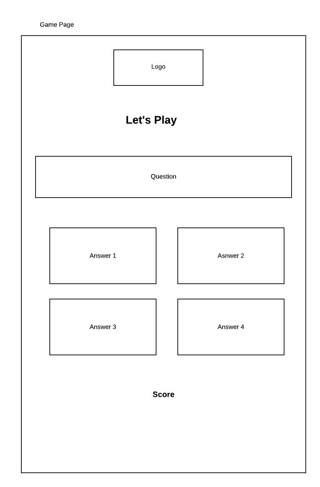
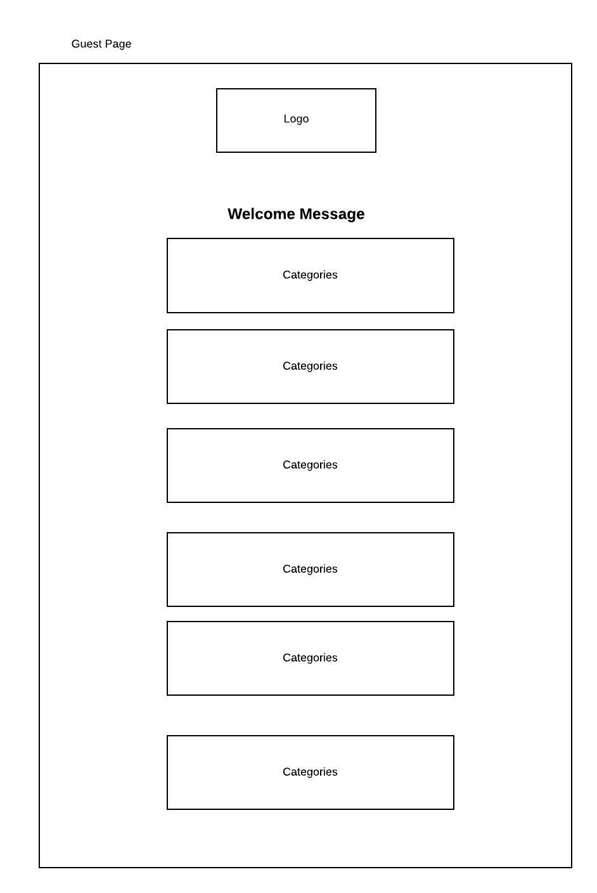
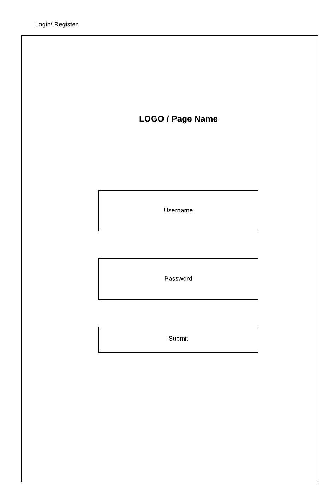
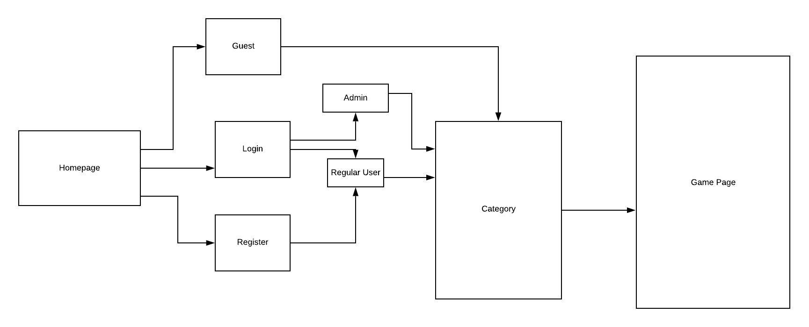
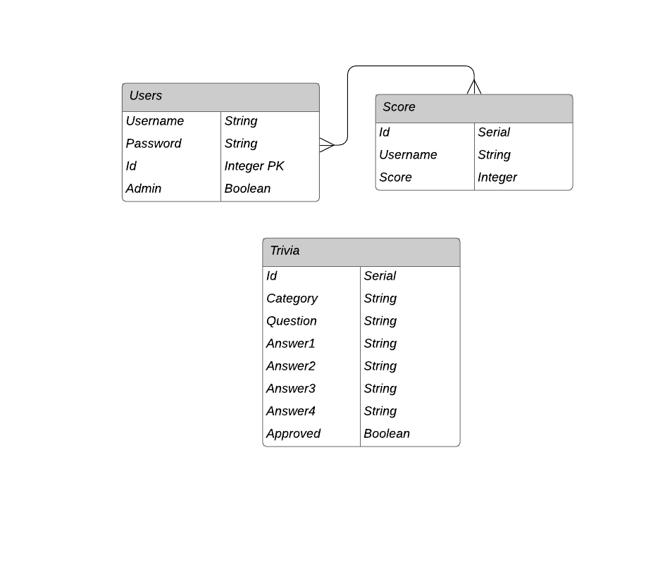

# **QUIZLY**
- By Sinara, Carolyn & Nolan
## Project Planning

> The Project Planning section should be completed for your project pitch with instructors.

### Overview

_**Quizly** is a trivia game site that allows users to be served a series of trivia questions one at a time, tallying up a score. Users will be able to register a username and password and login. There will be a section showing all-time high personal scores, and all-time high scores for all users. Users will be able to submit their own custom questions for administrator approval and eventually be added to the mix of questions. Users will be able to choose which category of questions they want to answer._

<br>
### Team Members

Created, designed, and developed by [Sinara Arliss](), [Nolan Giles](), and [Carolyn Tambini]() (Git Czar) for the General Assembly Software Engineering Immersive (November '19 Cohort (CHEETAHS)) Unit 3 Project. 

### Team Expectations

Team values and expectations can be found on our project's [Google document]().

### Permissions


### MVP Client (Front End)

#### Wireframes














### MVP


_The **Quizly** MVP consists of user registration/login, playing a single game of random multiple-choice trivia and receiving a score based on incorrect/correct answers regardless if logged in or not.  User if logged in will have a score saved to the high score list._


#### Goals

- _User login/registration_
- _Set # of Quiz questions proposed and answered (the game part)_
- _Score saved on DB_

#### Libraries

|     Library      | Description                                |
| :--------------: | :----------------------------------------- |
|      React       | _React is a declarative, efficient, and flexible JavaScript library for building user interfaces._ |
|   React Router   | _React Router is the standard routing library for React._ |
|     Express      | _Is a web application framework for Node.js, and is the de facto standard server framework for Node.js._ |
|  Express Router  | _Routing refers to how an application’s endpoints (URIs) respond to client requests._ |

#### Component Hierarchy

``` structure

src
|__ assets/
      |__ fonts
      |__ graphics
      |__ images
      |__ mockups
|__ components/
      |__ Header.js
      |__ Footer.js
      |__ GameBoard.js
      |__ Login.js
      |__ Register.js
      |__ Question.js
      |__ GuestLanding.js
      |__ UserLanding.js
      |__ AdminLanding.js
      |__ ScoreList.js
|__ services/
      |__ api_helper.js
```

#### Component Breakdown


|  Component   |    Type    | state | props | Description                                                      |
| :----------: | :--------: | :---: | :---: | :--------------------------------------------------------------- |
|    Header    | functional |   n   |   n   | _The header will contain the navigation and logo._               |
|  Footer  | functional |   n   |   n   | _The navigation will provide a link to each of the pages._       |
|   GameBoard    |   class    |   y   |   n   | _The gallery will render the posts using cards in flexbox._      |
| LandingPage | functional |   n   |   y   | _The cards will render the post info via props._                 |
|    ScoreList    | functional |   n   |   n   | _The footer will show info about me and a link to my portfolio._ |

#### Component Estimates

> Use this section to estimate the time necessary to build out each of the components you've described above.

| Task                | Priority | Estimated Time | Time Invested | Actual Time |
| ------------------- | :------: | :------------: | :-----------: | :---------: |
| Add Contact Form    |    L     |     3 hrs      |     2 hrs     |    3 hrs    |
| Create CRUD Actions |    H     |     3 hrs      |     1 hrs     |     TBD     |
| TOTAL               |          |     6 hrs      |     3 hrs     |     TBD     |


<br>

### MVP Server (Back End)



#### ERD Model

> Use this section to display an image of a computer generated ERD model.


#### Data Heirarchy

``` structure

database_db
|__ users/
|__ score/
|__ trivia/

```

<br>

***

<br>

### Post-MVP

#### Post-MVP Goals

- _Users can submit custom questions_
- _Custom questions can be submitted for Administrator approval before being added_
- _Players can choose which category of questions they want questions from_
- _Sound effects/music_
- _countdown timer & dynamic scoring_
- _user customized categories_
- _Viewing Score list different sorting_

#### Post-MVP Data

- _Utilize the Giphy API to welcome new users with funny gifs._

<br>

***

<br>

## Project Delivery

> The Delivery section should be expanded and revised as you work on your project.

### Code Showcase

> Use this section to include a brief code snippet of functionality that you are proud of an a brief description  

```
function reverse(string) {
	// here is the code to reverse a string of text
}
```

### Code Issues & Resolutions

> Use this section to list of all major issues encountered and their resolution.

| Error                                                   | Resolution                                             |
| :------------------------------------------------------ | :----------------------------------------------------- |
| `app.js:34 Uncaught SyntaxError: Unexpected identifier` | Missing comma after first object in sources {} object. |